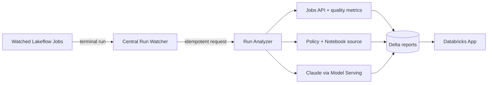

[한국어](README.ko.md) | English

# Databricks AI Job Checker

An AWS Databricks demo that centrally detects Lakeflow Job performance anomalies, data-quality failures, and semantic defects, then presents traceable evidence and suggested fixes.

> **A successful Job does not guarantee a correct result.** AI Job Checker inspects performance, freshness, completeness, and mismatches between business policy and Notebook implementation—then produces a reviewable fix.


<p align="center"><sub>Validated semantic-bug scenario — catches <code>SUM(ABS(amount))</code> inside a successful Job by comparing it with the net-revenue policy</sub></p>

## Why teams want to try it

| Operational blind spot | What AI Job Checker reveals |
|---|---|
| The Job succeeded but ran abnormally slowly | Separate setup, queue, execution, and total-duration anomalies |
| A table exists but customers are missing or stale | Exact completeness, freshness, null, and duplicate measurements |
| SQL ran successfully but implements the wrong LTV definition | A semantic verdict citing both policy and Notebook source |
| The issue is known but the fix is not | An evidence-linked explanation and reviewable unified diff |
| The AI conclusion is difficult to trust | Policy version/hash, model, evidence, and LLM invocation lineage |

### Five validated scenarios

| Scenario | Demonstrated behavior | Verified result |
|---|---|---|
| `normal` | Does not invent issues for a healthy run | `PASS · NONE · 0` |
| `stale` | Detects freshness beyond one day | `WARN · LOW · 15` |
| `incomplete` | Detects 90% customer completeness | `WARN · LOW · 15` |
| `semantic_bug` | Detects absolute-value aggregation instead of net revenue | `FAIL · MEDIUM · 35` + diff |
| `runtime_failure` | Explains the failed Job and missing quality output together | `FAIL · MEDIUM · 55` |

## Getting started

Prerequisites are Databricks CLI 0.292 or later, Python 3.10 or later, and Node.js 18 or later. You must explicitly select the Databricks profile and SQL warehouse ID used for installation.

```bash
git clone https://github.com/Stefano-Jang/dbx-ai-job-checker.git
cd dbx-ai-job-checker

./setup.sh doctor
./setup.sh configure --profile <profile> --warehouse-id <warehouse-id>
./setup.sh deploy --yes
./setup.sh verify
```

Run a scenario immediately after installation:

```bash
./setup.sh demo normal
./setup.sh demo semantic_bug
./setup.sh demo runtime_failure
```

## How it works



The source Job needs no webhook or callback task. A central watcher observes only selected Jobs, while a composite `(end_time, run_id)` watermark and Delta `MERGE` prevent duplicate analysis across restarts and retries.

Environment-specific values are stored in the Git-ignored `.local/config.json`. The tracked [`.local/config.example.json`](.local/config.example.json) documents the complete configuration shape and safe defaults. Another SA can reproduce the deployment by running `configure` with their own profile and warehouse:

```bash
./setup.sh configure \
  --profile <your-databricks-profile> \
  --warehouse-id <your-sql-warehouse-id> \
  --catalog ai_job_checker \
  --schema ops \
  --model system.ai.databricks-claude-sonnet-4-6 \
  --report-locale en
```

Tokens, passwords, and secrets are never stored in either the real configuration or the example files.

## Commands and deployed resources

Supported commands are `doctor`, `configure`, `admin-pack`, `deploy`, `resume`, `verify`, `demo`, and `status`. Demo scenarios are `normal`, `stale`, `incomplete`, `semantic_bug`, and `runtime_failure`.

- Central watcher, analyzer, bootstrap, and demo Lakeflow Jobs
- Registry, watermark, request, report, quality, and LLM-tracking Delta tables under `ai_job_checker.ops`
- Evidence-based analysis using a Claude Sonnet Foundation Model API
- A Databricks App with Korean/English UI, quality metrics, policy snapshots, and unified diffs

See [plan.md](plan.md) for the complete design.

## Supported environment

- Official validation environment: AWS Databricks
- Default UI and new-report language: Korean
- Required contacts: Account Admin, Workspace Admin, and Metastore/Unity Catalog Admin
- Target setup time: under 60 minutes, excluding administrator wait time
