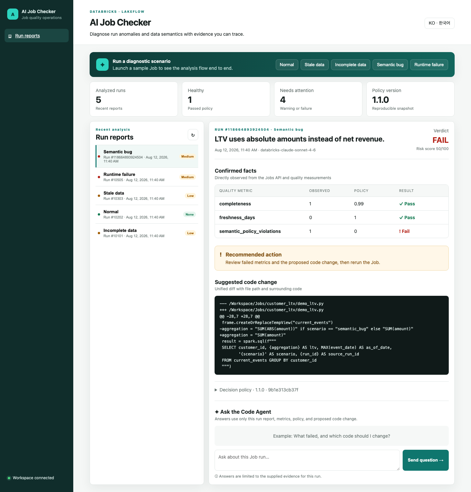
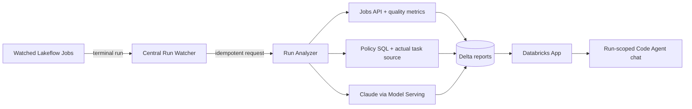
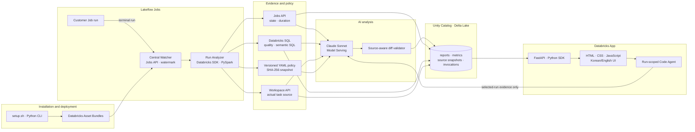

[한국어](README.ko.md) | English

# Databricks AI Job Checker

A Databricks Solution Accelerator that centrally detects Lakeflow Job performance anomalies, data-quality failures, and semantic defects, then provides source-grounded fixes and interactive run analysis.

> **A successful Job does not guarantee a correct result.** AI Job Checker evaluates quality and semantic policies, captures the actual task source, produces a verifiable diff, and lets users continue the investigation with a run-scoped Code Agent.



<p align="center"><sub>Production-style operations console — measured semantic evidence, contextual source diff, and a run-scoped Code Agent</sub></p>

## From diagnosis to remediation in one screen

- **Evidence-first decisions:** Replaces raw LLM JSON with a structured verdict, risk score, confirmed measurements, and recommended action.
- **Fixes grounded in actual source:** Captures the run's task source through the Workspace API and accepts a diff only when removed lines exist in that source.
- **Precise edit location:** Includes the real source path, hunk header, and surrounding code in every accepted diff.
- **Interactive Code Agent:** Answers follow-up questions in Korean or English using only the selected run's report, metrics, policy, and diff.
- **Complete UI localization:** Navigation, states, reports, errors, and chat switch together when the language changes.
- **Customer-defined semantics:** Replace the validation SQL in [`config/analysis-policy.yml`](config/analysis-policy.yml) to match the customer's data model.

## Why teams want to try it

| Operational blind spot | What AI Job Checker reveals |
|---|---|
| The Job succeeded but ran abnormally slowly | Separate setup, queue, execution, and total-duration anomalies |
| A table exists but customers are missing or stale | Exact completeness, freshness, null, and duplicate measurements |
| SQL ran successfully but implements the wrong LTV definition | A semantic verdict citing both policy and Notebook source |
| The issue is known but the fix is not | A source-verified diff with the real path and surrounding code |
| The report raises follow-up questions | A conversational Code Agent scoped to the selected run evidence |
| The AI conclusion is difficult to trust | Policy version/hash, model, evidence, and LLM invocation lineage |

### Five validated scenarios

| Scenario | Demonstrated behavior | Verified result |
|---|---|---|
| `normal` | Does not invent issues for a healthy run | `PASS · NONE · 0` |
| `stale` | Detects freshness beyond one day | `WARN · LOW · 15` |
| `incomplete` | Detects 90% customer completeness | `WARN · LOW · 15` |
| `semantic_bug` | Measures 10 net-revenue mismatches and locates the cause | `FAIL · MEDIUM · 50` + source-verified diff |
| `runtime_failure` | Explains the failed Job and missing quality output together | `FAIL · MEDIUM · 55` |

## Getting started

Prerequisites are Databricks CLI 0.292 or later, Python 3.10 or later, and Node.js 18 or later. You must explicitly select the Databricks profile and SQL warehouse ID used for installation.

### Permissions and administrator involvement

Keep these three identities separate:

| Identity | Responsibility |
|---|---|
| **Installer / deployment principal** | Deploys the Bundle, creates Jobs and the App, runs bootstrap, and attaches App resources |
| **Watcher / Analyzer run identity** | Reads target runs and task source, executes SQL measurements, queries Model Serving, and writes Delta records. It is the deployment principal by default |
| **App service principal** | Created automatically with the App and used at runtime for the warehouse, demo Job, serving endpoint, and report tables |

Administrator titles are less important than the following **object permissions**:

| Installation stage | Minimum permission | When to involve an administrator |
|---|---|---|
| Workspace and Bundle | Workspace access and permission to create files in the principal's home | Ask a **Workspace Admin** only when workspace access/entitlement is missing |
| Create and run Jobs | Permission to create Jobs and use serverless Jobs | Ask a **Workspace Admin** if Job creation is restricted or serverless is disabled |
| Observe customer Jobs | `CAN_VIEW` on every target Job | Ask the Job owner or **Workspace Admin** |
| Capture task source | `CAN_READ` on the notebook or containing directory | Ask the notebook owner or **Workspace Admin** |
| Create a new catalog | `CREATE CATALOG` on the metastore | Ask a **Metastore Admin** or delegated catalog administrator |
| Use an existing catalog | `USE CATALOG`, `CREATE SCHEMA`; plus `USE SCHEMA`, `CREATE TABLE`, `SELECT`, and `MODIFY` on the schema | Ask the catalog owner or **Metastore Admin** |
| Connect a SQL warehouse | Installer needs `CAN_USE`; the installer must also be allowed to share/attach the warehouse to the App | Ask the warehouse owner or **Workspace Admin** |
| Call Model Serving | Analyzer needs endpoint `CAN_QUERY`; installer must be allowed to share/attach the endpoint to the App | Ask the endpoint owner or **Workspace Admin** |
| Create the Databricks App | Permission to create Apps and upload Workspace files | Ask a **Workspace Admin** if App creation is restricted; involve an **Account Admin** only for account-level enablement or policy changes |
| App runtime access | App SP receives warehouse `CAN_USE`, demo Job `CAN_MANAGE_RUN`, endpoint `CAN_QUERY`, and `SELECT` on two report tables | Attached automatically by the Bundle; ask the failing resource's owner/admin only if attachment fails |

#### Are all three administrators always required?

- **Account Admin:** No. Required only when Databricks Apps is blocked by account/workspace policy or an account-level setting must change.
- **Workspace Admin:** No. Required only to provide missing workspace, Job/App creation, warehouse, endpoint, Job, or notebook permissions.
- **Metastore Admin:** No. Required only to create a catalog or grant catalog/schema privileges when those privileges have not been delegated.
- **Resource owners:** Prefer the Job, notebook, warehouse, endpoint, or catalog owner granting the minimum object permission instead of requesting a broad admin role.

A least-privilege installation has an administrator prepare the catalog/schema and warehouse, then delegate only the required grants:

```sql
-- Existing catalog: run as catalog owner or Metastore Admin
GRANT USE CATALOG, CREATE SCHEMA ON CATALOG ai_job_checker TO `<installer-principal>`;

-- If the schema is created in advance
GRANT USE CATALOG ON CATALOG ai_job_checker TO `<installer-principal>`;
GRANT USE SCHEMA, CREATE TABLE, SELECT, MODIFY
ON SCHEMA ai_job_checker.ops TO `<installer-principal>`;
GRANT USE SCHEMA, CREATE TABLE, SELECT, MODIFY
ON SCHEMA ai_job_checker.demo TO `<installer-principal>`;
```

Grant warehouse `CAN_USE`, target Job `CAN_VIEW`, notebook `CAN_READ`, and endpoint `CAN_QUERY` from each resource's **Permissions** screen. You do not need to pre-create the App SP: Databricks creates it with the App, and the Bundle attaches the runtime grants declared in [`resources/app.app.yml`](resources/app.app.yml).

Access to the `system.lakeflow` and `system.ai_gateway` system tables is optional and not required for the core installation. Request `USE CATALOG`, `USE SCHEMA`, and `SELECT` only when extending the accelerator with centralized usage or AI Gateway auditing.

```bash
git clone https://github.com/Stefano-Jang/dbx-ai-job-checker.git
cd dbx-ai-job-checker

./setup.sh doctor
./setup.sh configure --profile <profile> --warehouse-id <warehouse-id>
./setup.sh deploy --yes
./setup.sh verify
```

Run a scenario immediately after installation:

```bash
./setup.sh demo normal
./setup.sh demo semantic_bug
./setup.sh demo runtime_failure
```

## How it works



The source Job needs no webhook or callback task. A central watcher observes only selected Jobs, while a composite `(end_time, run_id)` watermark and Delta `MERGE` prevent duplicate analysis across restarts and retries.

### Technology architecture and end-to-end flow



| Layer | Technology | Responsibility |
|---|---|---|
| Deployment | Databricks Asset Bundles, Databricks CLI, Python setup CLI | Reproducibly deploy Jobs, App, permissions, and environment settings |
| Orchestration | Lakeflow Jobs, Jobs API, central watcher | Detect terminal runs and manage idempotent analysis requests |
| Measurement | PySpark, Databricks SQL, YAML policy | Measure execution, quality, and customer-defined semantic rules |
| Source evidence | Workspace API, Delta `source_snapshots` | Capture and trace the actual task source for each run |
| AI | Claude Sonnet, Databricks Model Serving, typed SDK messages | Evidence-scoped analysis, remediation, and follow-up answers |
| Guardrails | Source-aware diff validator, policy hash | Validate files, removed lines, hunks, context, and reproducibility |
| Storage | Unity Catalog, Delta Lake, Delta `MERGE` | Preserve reports, metrics, source snapshots, and invocation history |
| Experience | Databricks Apps, FastAPI, HTML/CSS/JavaScript | Fully localized operations console and Code Agent chat |

Environment-specific values are stored in the Git-ignored `.local/config.json`. The tracked [`.local/config.example.json`](.local/config.example.json) documents the complete configuration shape and safe defaults. Another SA can reproduce the deployment by running `configure` with their own profile and warehouse:

```bash
./setup.sh configure \
  --profile <your-databricks-profile> \
  --warehouse-id <your-sql-warehouse-id> \
  --catalog ai_job_checker \
  --schema ops \
  --model databricks-claude-sonnet-4-6 \
  --report-locale en
```

Tokens, passwords, and secrets are never stored in either the real configuration or the example files.

## Commands and deployed resources

Supported commands are `doctor`, `configure`, `admin-pack`, `deploy`, `resume`, `verify`, `demo`, and `status`. Demo scenarios are `normal`, `stale`, `incomplete`, `semantic_bug`, and `runtime_failure`.

- Central watcher, analyzer, bootstrap, and demo Lakeflow Jobs
- Registry, watermark, request, report, quality, and LLM-tracking Delta tables under `ai_job_checker.ops`
- Evidence-based analysis using a Claude Sonnet Foundation Model API
- A fully localized Databricks App with structured reports, source-verified diffs, and a run-scoped Code Agent

See [plan.md](plan.md) for the complete design.

## Supported environment

- Official validation environment: AWS Databricks
- Default UI and new-report language: Korean
- Administrator involvement: only for missing object permissions; use the relevant resource owner or Account/Workspace/Metastore Admin
- Target setup time: under 60 minutes, excluding administrator wait time
