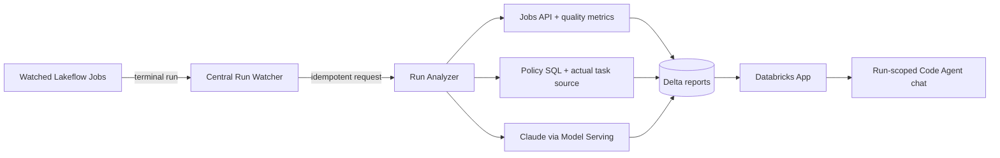
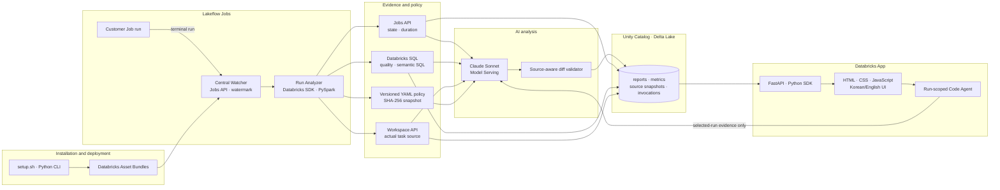

[한국어](README.ko.md) | English

# Databricks AI Job Checker

A Databricks Solution Accelerator that centrally detects Lakeflow Job performance anomalies, data-quality failures, and semantic defects, then provides source-grounded fixes and interactive run analysis.

> **A successful Job does not guarantee a correct result.** AI Job Checker evaluates quality and semantic policies, captures the actual task source, produces a verifiable diff, and lets users continue the investigation with a run-scoped Code Agent.


<p align="center"><sub>Production-style operations console — measured semantic evidence, contextual source diff, and a run-scoped Code Agent</sub></p>

## From diagnosis to remediation in one screen

- **Evidence-first decisions:** Replaces raw LLM JSON with a structured verdict, risk score, confirmed measurements, and recommended action.
- **Fixes grounded in actual source:** Captures the run's task source through the Workspace API and accepts a diff only when removed lines exist in that source.
- **Precise edit location:** Includes the real source path, hunk header, and surrounding code in every accepted diff.
- **Interactive Code Agent:** Answers follow-up questions in Korean or English using only the selected run's report, metrics, policy, and diff.
- **Complete UI localization:** Navigation, states, reports, errors, and chat switch together when the language changes.
- **Customer-defined semantics:** Replace the validation SQL in [`config/analysis-policy.yml`](config/analysis-policy.yml) to match the customer's data model.

## Why teams want to try it

| Operational blind spot | What AI Job Checker reveals |
|---|---|
| The Job succeeded but ran abnormally slowly | Separate setup, queue, execution, and total-duration anomalies |
| A table exists but customers are missing or stale | Exact completeness, freshness, null, and duplicate measurements |
| SQL ran successfully but implements the wrong LTV definition | A semantic verdict citing both policy and Notebook source |
| The issue is known but the fix is not | A source-verified diff with the real path and surrounding code |
| The report raises follow-up questions | A conversational Code Agent scoped to the selected run evidence |
| The AI conclusion is difficult to trust | Policy version/hash, model, evidence, and LLM invocation lineage |

### Five validated scenarios

| Scenario | Demonstrated behavior | Verified result |
|---|---|---|
| `normal` | Does not invent issues for a healthy run | `PASS · NONE · 0` |
| `stale` | Detects freshness beyond one day | `WARN · LOW · 15` |
| `incomplete` | Detects 90% customer completeness | `WARN · LOW · 15` |
| `semantic_bug` | Measures 10 net-revenue mismatches and locates the cause | `FAIL · MEDIUM · 50` + source-verified diff |
| `runtime_failure` | Explains the failed Job and missing quality output together | `FAIL · MEDIUM · 55` |

## Getting started

Prerequisites are Databricks CLI 0.292 or later, Python 3.10 or later, and Node.js 18 or later. You must explicitly select the Databricks profile and SQL warehouse ID used for installation.

```bash
git clone https://github.com/Stefano-Jang/dbx-ai-job-checker.git
cd dbx-ai-job-checker

./setup.sh doctor
./setup.sh configure --profile <profile> --warehouse-id <warehouse-id>
./setup.sh deploy --yes
./setup.sh verify
```

Run a scenario immediately after installation:

```bash
./setup.sh demo normal
./setup.sh demo semantic_bug
./setup.sh demo runtime_failure
```

## How it works



The source Job needs no webhook or callback task. A central watcher observes only selected Jobs, while a composite `(end_time, run_id)` watermark and Delta `MERGE` prevent duplicate analysis across restarts and retries.

### Technology architecture and end-to-end flow



| Layer | Technology | Responsibility |
|---|---|---|
| Deployment | Databricks Asset Bundles, Databricks CLI, Python setup CLI | Reproducibly deploy Jobs, App, permissions, and environment settings |
| Orchestration | Lakeflow Jobs, Jobs API, central watcher | Detect terminal runs and manage idempotent analysis requests |
| Measurement | PySpark, Databricks SQL, YAML policy | Measure execution, quality, and customer-defined semantic rules |
| Source evidence | Workspace API, Delta `source_snapshots` | Capture and trace the actual task source for each run |
| AI | Claude Sonnet, Databricks Model Serving, typed SDK messages | Evidence-scoped analysis, remediation, and follow-up answers |
| Guardrails | Source-aware diff validator, policy hash | Validate files, removed lines, hunks, context, and reproducibility |
| Storage | Unity Catalog, Delta Lake, Delta `MERGE` | Preserve reports, metrics, source snapshots, and invocation history |
| Experience | Databricks Apps, FastAPI, HTML/CSS/JavaScript | Fully localized operations console and Code Agent chat |

Environment-specific values are stored in the Git-ignored `.local/config.json`. The tracked [`.local/config.example.json`](.local/config.example.json) documents the complete configuration shape and safe defaults. Another SA can reproduce the deployment by running `configure` with their own profile and warehouse:

```bash
./setup.sh configure \
  --profile <your-databricks-profile> \
  --warehouse-id <your-sql-warehouse-id> \
  --catalog ai_job_checker \
  --schema ops \
  --model system.ai.databricks-claude-sonnet-4-6 \
  --report-locale en
```

Tokens, passwords, and secrets are never stored in either the real configuration or the example files.

## Commands and deployed resources

Supported commands are `doctor`, `configure`, `admin-pack`, `deploy`, `resume`, `verify`, `demo`, and `status`. Demo scenarios are `normal`, `stale`, `incomplete`, `semantic_bug`, and `runtime_failure`.

- Central watcher, analyzer, bootstrap, and demo Lakeflow Jobs
- Registry, watermark, request, report, quality, and LLM-tracking Delta tables under `ai_job_checker.ops`
- Evidence-based analysis using a Claude Sonnet Foundation Model API
- A fully localized Databricks App with structured reports, source-verified diffs, and a run-scoped Code Agent

See [plan.md](plan.md) for the complete design.

## Supported environment

- Official validation environment: AWS Databricks
- Default UI and new-report language: Korean
- Required contacts: Account Admin, Workspace Admin, and Metastore/Unity Catalog Admin
- Target setup time: under 60 minutes, excluding administrator wait time
