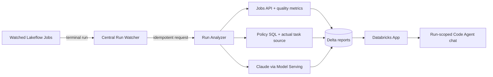
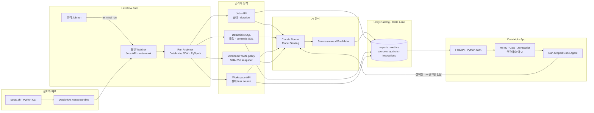

[한국어](README.ko.md) | [English](README.en.md)

# Databricks AI Job Checker

Lakeflow Job 실행의 성능, 데이터 품질, 의미론적 오류를 중앙에서 감지하고, 실제 task source에 근거한 수정안과 대화형 분석을 제공하는 Databricks Solution Accelerator입니다.

> **Job이 성공했다고 결과까지 맞는 것은 아닙니다.** AI Job Checker는 실행 직후 품질·의미론 정책을 측정하고, 실제 실행 소스를 캡처해 검증 가능한 diff를 만들며, 선택한 run에 대해 Code Agent와 후속 질문을 이어갈 수 있게 합니다.


<p align="center"><sub>상용 운영 콘솔형 UI — 실제 semantic 측정, 파일 경로와 주변 문맥을 포함한 diff, run-scoped Code Agent</sub></p>

## 한 화면에서 진단부터 수정까지

- **근거 중심 판정:** raw LLM JSON 대신 판정, 위험 점수, 확인된 측정값, 권장 조치를 구조화해 표시합니다.
- **실제 소스 기반 수정:** 해당 run의 task source를 Workspace API로 캡처하고, 삭제 줄이 원본에 실제 존재할 때만 unified diff를 채택합니다.
- **정확한 수정 위치:** diff에 실제 source path, hunk header, 변경 전후 문맥을 포함합니다.
- **대화형 Code Agent:** 선택한 run의 리포트·metrics·policy·diff만 컨텍스트로 사용해 한국어와 영어로 후속 질문에 답합니다.
- **전체 화면 다국어:** 탐색, 상태, 빈 화면, 오류, 리포트, 채팅까지 언어 전환 즉시 함께 변경됩니다.
- **고객 맞춤 정책:** semantic validation SQL은 [`config/analysis-policy.yml`](config/analysis-policy.yml)에서 고객 데이터 모델에 맞게 교체할 수 있습니다.

## 왜 써보고 싶은가

| 기존 운영의 빈틈 | AI Job Checker가 보여주는 것 |
|---|---|
| Job은 성공했지만 평소보다 비정상적으로 느림 | setup, queue, execution, total duration 이상 |
| 테이블은 생성됐지만 고객이 누락되거나 오래됨 | completeness, freshness, null/duplicate 측정값 |
| SQL은 실행됐지만 LTV 정의가 틀림 | 정책과 Notebook source를 인용한 의미론 판정 |
| 어디를 고칠지 모름 | 실제 파일 경로와 주변 코드를 포함한 검증된 unified diff |
| 리포트 이후 추가 질문이 생김 | 선택한 run의 근거로만 답하는 대화형 Code Agent |
| AI 결론의 이유가 불명확 | policy hash, model, evidence와 LLM invocation 추적 |

### 실제 검증한 5개 시나리오

| 시나리오 | 효과 | 검증 결과 |
|---|---|---|
| `normal` | 정상 run에는 문제를 만들지 않음 | `PASS · NONE · 0` |
| `stale` | freshness 1일 초과 탐지 | `WARN · LOW · 15` |
| `incomplete` | 고객 completeness 90% 탐지 | `WARN · LOW · 15` |
| `semantic_bug` | 실제 순매출 불일치 10건과 원인 코드를 탐지 | `FAIL · MEDIUM · 50` + source-verified diff |
| `runtime_failure` | 원본 Job 실패와 품질 부재 설명 | `FAIL · MEDIUM · 55` |

## 시작하기

필요한 항목은 Databricks CLI 0.292 이상, Python 3.10 이상, Node.js 18 이상입니다. Databricks profile과 SQL warehouse ID는 사용자가 직접 선택해야 합니다.

### 권한과 관리자 협업

| 주체 | 역할 |
|---|---|
| **설치자 / 배포 principal** | Bundle 배포, Jobs·App 생성, bootstrap 실행, 리소스 권한 연결 |
| **Watcher / Analyzer 실행 주체** | 대상 run 조회, Notebook source 읽기, SQL 측정, Model Serving 호출, Delta 기록. 기본값은 배포 principal과 동일 |
| **App service principal** | App 생성 시 자동 생성되며 warehouse, demo Job, endpoint, 리포트 table에 런타임 접근 |

| 단계 | 최소 객체 권한 | 관리자에게 요청할 때 |
|---|---|---|
| Workspace/Bundle | Workspace access, 자신의 home에 파일 생성 | access entitlement가 없으면 **Workspace Admin** |
| Jobs 생성·실행 | Job 생성 권한, serverless Jobs 사용 가능 | 생성 제한 또는 serverless 비활성 시 **Workspace Admin** |
| 고객 Job 감시 | 대상 Job `CAN_VIEW` | Job owner 또는 **Workspace Admin** |
| task source 캡처 | Notebook/directory `CAN_READ` | Notebook owner 또는 **Workspace Admin** |
| 신규 catalog | metastore `CREATE CATALOG` | **Metastore Admin** 또는 위임 관리자 |
| 기존 catalog/schema | `USE CATALOG`, `CREATE SCHEMA`, `USE SCHEMA`, `CREATE TABLE`, `SELECT`, `MODIFY` | Catalog owner 또는 **Metastore Admin** |
| SQL warehouse | 설치자 `CAN_USE`; App 연결 권한을 공유할 수 있는 권한 | Warehouse owner 또는 **Workspace Admin** |
| Model Serving | analyzer `CAN_QUERY`; App 연결 권한을 공유할 수 있는 권한 | Endpoint owner 또는 **Workspace Admin** |
| Databricks App | App 생성과 Workspace 파일 업로드 | 정책 제한 시 **Workspace Admin**; account-level 활성화/정책 변경 시에만 **Account Admin** |
| App runtime | App SP에 warehouse `CAN_USE`, demo Job `CAN_MANAGE_RUN`, endpoint `CAN_QUERY`, 리포트 table `SELECT` | Bundle이 자동 연결. 실패한 리소스의 owner/admin에게 요청 |

**Account Admin은 일반 설치에 필요하지 않습니다.** Apps가 계정 정책으로 차단됐을 때만 필요합니다. 설치자가 필요한 객체 권한을 이미 위임받았다면 Workspace Admin과 Metastore Admin도 필요하지 않습니다. 가능하면 전체 관리자 대신 Job/Notebook/warehouse/endpoint/catalog owner에게 위 표의 최소 권한만 요청하세요.

```sql
-- 기존 catalog 사용 시 Catalog owner 또는 Metastore Admin이 실행
GRANT USE CATALOG, CREATE SCHEMA ON CATALOG ai_job_checker TO `<installer-principal>`;

-- 관리자가 schema를 미리 만든 경우
GRANT USE CATALOG ON CATALOG ai_job_checker TO `<installer-principal>`;
GRANT USE SCHEMA, CREATE TABLE, SELECT, MODIFY
ON SCHEMA ai_job_checker.ops TO `<installer-principal>`;
GRANT USE SCHEMA, CREATE TABLE, SELECT, MODIFY
ON SCHEMA ai_job_checker.demo TO `<installer-principal>`;
```

Warehouse `CAN_USE`, 대상 Job `CAN_VIEW`, Notebook `CAN_READ`, endpoint `CAN_QUERY`는 각 리소스의 Permissions 화면에서 installer/watcher principal에 부여합니다. App SP는 App 생성 시 자동 생성되며 [`resources/app.app.yml`](resources/app.app.yml)의 권한이 배포 중 연결됩니다. `system.lakeflow`와 `system.ai_gateway` 접근은 핵심 실행에는 필요하지 않고 중앙 감사 기능을 확장할 때만 필요합니다.

```bash
git clone https://github.com/Stefano-Jang/dbx-ai-job-checker.git
cd dbx-ai-job-checker

./setup.sh doctor
./setup.sh configure --profile <profile> --warehouse-id <warehouse-id>
./setup.sh deploy --yes
./setup.sh verify
```

```bash
./setup.sh demo normal
./setup.sh demo semantic_bug
./setup.sh demo runtime_failure
```

## 동작 방식



원본 Job을 수정하지 않고 중앙 watcher가 선택된 Job만 감시합니다. `(end_time, run_id)` watermark와 Delta `MERGE`로 재시작·재시도에도 중복 분석을 막습니다.

### 기술 아키텍처와 전체 데이터 흐름



| 계층 | 사용 기술 | 역할 |
|---|---|---|
| 배포 | Databricks Asset Bundles, Databricks CLI, Python setup CLI | Jobs, App, 권한과 환경 설정을 재현 가능하게 배포 |
| 오케스트레이션 | Lakeflow Jobs, Jobs API, 중앙 watcher | 종료 run 탐지와 idempotent 요청 관리 |
| 측정 | PySpark, Databricks SQL, YAML policy | 실행·품질·고객 정의 semantic 규칙 측정 |
| 소스 근거 | Workspace API, Delta `source_snapshots` | 해당 run의 실제 task source 캡처와 추적 |
| AI | Claude Sonnet, Databricks Model Serving, typed SDK messages | 근거 한정 분석, 수정안, 후속 질의응답 |
| 안전장치 | source-aware diff validator, policy hash | 파일·삭제 줄·hunk·문맥 검증과 판정 재현 |
| 저장 | Unity Catalog, Delta Lake, Delta `MERGE` | 리포트, metrics, 소스와 호출 이력 보존 |
| 경험 | Databricks Apps, FastAPI, HTML/CSS/JavaScript | 전체 i18n 운영 콘솔과 Code Agent 제공 |

실제 환경값은 Git에서 제외된 `.local/config.json`에 저장됩니다. 설정 구조와 안전한 기본값은 [`.local/config.example.json`](.local/config.example.json)에서 확인할 수 있습니다. 다른 SA는 자신의 profile과 warehouse를 사용해 `configure`를 실행하면 동일한 리소스를 재현할 수 있습니다.

```bash
./setup.sh configure \
  --profile <your-databricks-profile> \
  --warehouse-id <your-sql-warehouse-id> \
  --catalog ai_job_checker \
  --schema ops \
  --model databricks-claude-sonnet-4-6 \
  --report-locale ko
```

token, password, secret은 실제 설정과 예시 파일 어디에도 저장하지 않습니다.

## 명령과 배포 리소스

지원 명령은 `doctor`, `configure`, `admin-pack`, `deploy`, `resume`, `verify`, `demo`, `status`입니다. 데모 시나리오는 `normal`, `stale`, `incomplete`, `semantic_bug`, `runtime_failure`입니다.

- 중앙 watcher, analyzer, bootstrap과 demo Lakeflow Jobs
- `ai_job_checker.ops`의 registry, watermark, 요청, 리포트, 품질 및 LLM 추적 Delta tables
- Claude Sonnet Foundation Model API를 사용하는 근거 기반 분석
- 한국어/영어 UI, 품질 metric, 정책 snapshot과 unified diff를 표시하는 Databricks App

전체 설계는 [plan.md](plan.md)를 참고하세요.

## 지원 범위

- 공식 검증 환경: AWS Databricks
- 기본 UI 및 신규 리포트 언어: 한국어
- 필요한 관리자 역할: Account Admin, Workspace Admin, Metastore/Unity Catalog Admin
- 목표 설치 시간: 관리자 대기 시간을 제외하고 60분 이내
