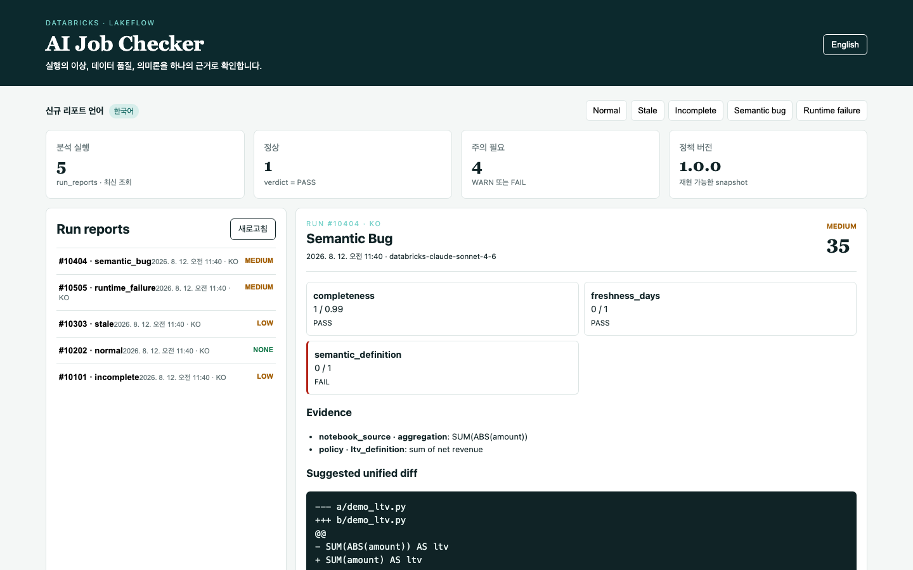
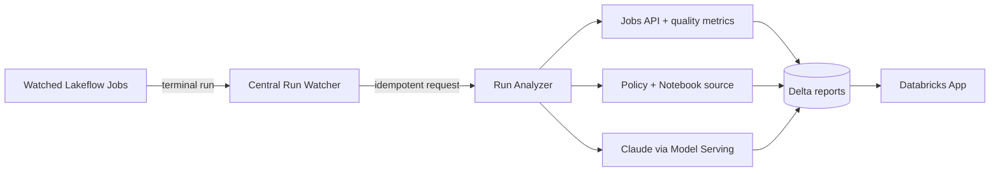

한국어 | [English](README.en.md)

# Databricks AI Job Checker

Lakeflow Job 실행의 성능, 데이터 품질, 의미론적 오류를 중앙에서 감지하고 근거와 수정안을 보여주는 AWS Databricks 데모입니다.

> **Job이 성공했다고 결과까지 맞는 것은 아닙니다.** AI Job Checker는 실행이 끝난 순간부터 성능 이상, freshness/completeness, 비즈니스 정의와 Notebook 구현의 불일치를 검사하고 수정 가능한 diff까지 만듭니다.



<p align="center"><sub>검증된 semantic bug 시나리오 — 성공한 Job 안의 <code>SUM(ABS(amount))</code>를 정책의 순매출 정의와 비교해 탐지</sub></p>

## 왜 써보고 싶은가

| 기존 운영의 빈틈 | AI Job Checker가 보여주는 것 |
|---|---|
| Job은 성공했지만 평소보다 비정상적으로 느림 | setup, queue, execution, total duration 이상 |
| 테이블은 생성됐지만 고객이 누락되거나 오래됨 | completeness, freshness, null/duplicate 등 정확한 측정값 |
| SQL은 실행됐지만 LTV 정의가 틀림 | 정책과 Notebook source를 함께 인용한 의미론 판정 |
| 문제를 찾았지만 어디를 고칠지 모름 | 근거가 연결된 설명과 바로 검토 가능한 unified diff |
| AI가 왜 그런 결론을 냈는지 불명확 | policy version/hash, 사용 model, evidence와 LLM invocation 추적 |

### 실제 검증한 5개 시나리오

| 시나리오 | 기대 효과 | 검증 결과 |
|---|---|---|
| `normal` | 정상 run을 억지로 문제 삼지 않음 | `PASS · NONE · 0` |
| `stale` | freshness 1일 초과 탐지 | `WARN · LOW · 15` |
| `incomplete` | 고객 completeness 90% 탐지 | `WARN · LOW · 15` |
| `semantic_bug` | 절대금액 합계를 순매출 오류로 탐지 | `FAIL · MEDIUM · 35` + diff |
| `runtime_failure` | 원본 Job 실패와 품질 부재를 함께 설명 | `FAIL · MEDIUM · 55` |

## 시작하기

필요한 항목은 Databricks CLI 0.292 이상, Python 3.10 이상, Node.js 18 이상입니다. 설치 과정에서 사용할 Databricks profile과 SQL warehouse ID는 사용자가 직접 선택해야 합니다.

```bash
git clone https://github.com/Stefano-Jang/dbx-ai-job-checker.git
cd dbx-ai-job-checker

./setup.sh doctor
./setup.sh configure --profile <profile> --warehouse-id <warehouse-id>
./setup.sh deploy --yes
./setup.sh verify
```

설치가 끝나면 바로 시나리오를 실행할 수 있습니다.

```bash
./setup.sh demo normal
./setup.sh demo semantic_bug
./setup.sh demo runtime_failure
```

## 동작 방식



원본 Job에 webhook이나 callback task를 심지 않습니다. 중앙 watcher가 선택된 Job만 감시하며 `(end_time, run_id)` watermark와 Delta `MERGE`로 재시작·재시도에도 중복 분석을 막습니다.

실제 설치 설정은 Git에서 제외된 `.local/config.json`에 저장됩니다. 재현 가능한 설정 구조와 기본값은 추적되는 [`.local/config.example.json`](.local/config.example.json)에 있습니다. token, password, secret은 실제 설정과 예시 어디에도 저장하지 않습니다.

다른 SA가 재현할 때는 예시 파일을 직접 수정해 배포하지 말고, 자신의 profile과 warehouse를 명시해 `configure`를 실행합니다.

```bash
./setup.sh configure \
  --profile <your-databricks-profile> \
  --warehouse-id <your-sql-warehouse-id> \
  --catalog ai_job_checker \
  --schema ops \
  --model system.ai.databricks-claude-sonnet-4-6 \
  --report-locale ko
```

지원 명령은 `doctor`, `configure`, `admin-pack`, `deploy`, `resume`, `verify`, `demo`, `status`입니다. `demo` 시나리오는 `normal`, `stale`, `incomplete`, `semantic_bug`, `runtime_failure`를 지원합니다.

배포되는 리소스:

- 중앙 watcher, analyzer, bootstrap과 demo Lakeflow Jobs
- `ai_job_checker.ops`의 감시 registry, watermark, 요청, 리포트, 품질 및 LLM 추적 Delta tables
- Claude Sonnet Foundation Model API를 사용하는 근거 기반 분석
- 한국어/영어 UI, run 목록, 품질 metric, 정책 snapshot과 unified diff를 표시하는 Databricks App

전체 설계와 단계별 확장 계획은 [plan.md](plan.md)를 참고하세요.

## 지원 범위

- 공식 검증 환경: AWS Databricks
- 기본 UI 및 신규 리포트 언어: 한국어
- 필요한 관리자 역할: Account Admin, Workspace Admin, Metastore/Unity Catalog Admin
- 목표 설치 시간: 관리자 대기 시간을 제외하고 60분 이내
