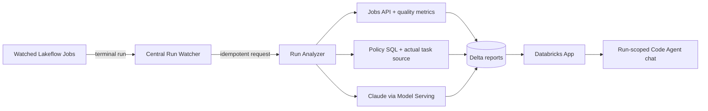
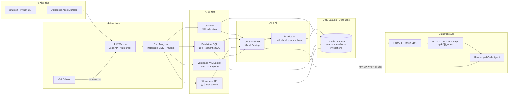

한국어 | [English](README.en.md)

# Databricks AI Job Checker

Lakeflow Job 실행의 성능, 데이터 품질, 의미론적 오류를 중앙에서 감지하고, 실제 task source에 근거한 수정안과 대화형 분석을 제공하는 Databricks Solution Accelerator입니다.

> **Job이 성공했다고 결과까지 맞는 것은 아닙니다.** AI Job Checker는 실행 직후 품질·의미론 정책을 측정하고, 실제 실행 소스를 캡처해 검증 가능한 diff를 만들며, 선택한 run에 대해 Code Agent와 후속 질문을 이어갈 수 있게 합니다.


<p align="center"><sub>상용 운영 콘솔형 UI — 실제 semantic 측정, 파일 경로와 주변 문맥을 포함한 diff, run-scoped Code Agent</sub></p>

## 한 화면에서 진단부터 수정까지

- **근거 중심 판정:** raw LLM JSON 대신 판정, 위험 점수, 확인된 측정값, 권장 조치를 구조화해 표시합니다.
- **실제 소스 기반 수정:** 해당 run의 task source를 Workspace API로 캡처하고, 삭제 줄이 원본에 실제 존재할 때만 unified diff를 채택합니다.
- **정확한 수정 위치:** diff에 실제 source path, hunk header, 변경 전후 문맥을 포함합니다.
- **대화형 Code Agent:** 선택한 run의 리포트·metrics·policy·diff만 컨텍스트로 사용해 한국어와 영어로 후속 질문에 답합니다.
- **전체 화면 다국어:** 탐색, 상태, 빈 화면, 오류, 리포트, 채팅까지 언어 전환 즉시 함께 변경됩니다.
- **고객 맞춤 정책:** semantic validation SQL은 [`config/analysis-policy.yml`](config/analysis-policy.yml)에서 고객 데이터 모델에 맞게 교체할 수 있습니다.

## 왜 써보고 싶은가

| 기존 운영의 빈틈 | AI Job Checker가 보여주는 것 |
|---|---|
| Job은 성공했지만 평소보다 비정상적으로 느림 | setup, queue, execution, total duration 이상 |
| 테이블은 생성됐지만 고객이 누락되거나 오래됨 | completeness, freshness, null/duplicate 등 정확한 측정값 |
| SQL은 실행됐지만 LTV 정의가 틀림 | 정책과 Notebook source를 함께 인용한 의미론 판정 |
| 문제를 찾았지만 어디를 고칠지 모름 | 실제 파일 경로와 주변 코드를 포함한 검증된 unified diff |
| 리포트를 본 뒤 추가 질문이 생김 | 선택한 run의 근거로만 답하는 대화형 Code Agent |
| AI가 왜 그런 결론을 냈는지 불명확 | policy version/hash, 사용 model, evidence와 LLM invocation 추적 |

### 실제 검증한 5개 시나리오

| 시나리오 | 기대 효과 | 검증 결과 |
|---|---|---|
| `normal` | 정상 run을 억지로 문제 삼지 않음 | `PASS · NONE · 0` |
| `stale` | freshness 1일 초과 탐지 | `WARN · LOW · 15` |
| `incomplete` | 고객 completeness 90% 탐지 | `WARN · LOW · 15` |
| `semantic_bug` | 실제 순매출 불일치 10건과 원인 코드를 탐지 | `FAIL · MEDIUM · 50` + source-verified diff |
| `runtime_failure` | 원본 Job 실패와 품질 부재를 함께 설명 | `FAIL · MEDIUM · 55` |

## 시작하기

필요한 항목은 Databricks CLI 0.292 이상, Python 3.10 이상, Node.js 18 이상입니다. 설치 과정에서 사용할 Databricks profile과 SQL warehouse ID는 사용자가 직접 선택해야 합니다.

```bash
git clone https://github.com/Stefano-Jang/dbx-ai-job-checker.git
cd dbx-ai-job-checker

./setup.sh doctor
./setup.sh configure --profile <profile> --warehouse-id <warehouse-id>
./setup.sh deploy --yes
./setup.sh verify
```

설치가 끝나면 바로 시나리오를 실행할 수 있습니다.

```bash
./setup.sh demo normal
./setup.sh demo semantic_bug
./setup.sh demo runtime_failure
```

## 동작 방식



원본 Job에 webhook이나 callback task를 심지 않습니다. 중앙 watcher가 선택된 Job만 감시하며 `(end_time, run_id)` watermark와 Delta `MERGE`로 재시작·재시도에도 중복 분석을 막습니다.

### 기술 아키텍처와 전체 데이터 흐름



| 계층 | 사용 기술 | 역할 |
|---|---|---|
| 배포 | Databricks Asset Bundles, Databricks CLI, Python setup CLI | Jobs, App, 권한과 환경별 설정을 재현 가능하게 배포 |
| 오케스트레이션 | Lakeflow Jobs, Jobs API, 중앙 watcher | 종료된 run 탐지, watermark와 idempotent 요청 관리 |
| 측정 | PySpark, Databricks SQL, YAML policy | 실행·품질·고객 정의 semantic 규칙을 실제 값으로 측정 |
| 소스 근거 | Workspace API, `source_snapshots` Delta table | 분석 대상 run의 실제 task source를 캡처하고 추적 |
| AI | Claude Sonnet on Databricks Model Serving, typed SDK messages | 근거 한정 분석, 수정안 생성, 후속 질의응답 |
| 안전장치 | source-aware diff validator, policy hash | 존재하는 파일·삭제 줄·hunk·문맥을 검증하고 판정 재현성 확보 |
| 저장 | Unity Catalog, Delta Lake, Delta `MERGE` | 리포트, metrics, 요청, 소스, LLM 호출 이력 보존 |
| 경험 | Databricks Apps, FastAPI, HTML/CSS/JavaScript | 상용 콘솔형 리포트, 전체 i18n, Code Agent 채팅 제공 |

실제 설치 설정은 Git에서 제외된 `.local/config.json`에 저장됩니다. 재현 가능한 설정 구조와 기본값은 추적되는 [`.local/config.example.json`](.local/config.example.json)에 있습니다. token, password, secret은 실제 설정과 예시 어디에도 저장하지 않습니다.

다른 SA가 재현할 때는 예시 파일을 직접 수정해 배포하지 말고, 자신의 profile과 warehouse를 명시해 `configure`를 실행합니다.

```bash
./setup.sh configure \
  --profile <your-databricks-profile> \
  --warehouse-id <your-sql-warehouse-id> \
  --catalog ai_job_checker \
  --schema ops \
  --model system.ai.databricks-claude-sonnet-4-6 \
  --report-locale ko
```

지원 명령은 `doctor`, `configure`, `admin-pack`, `deploy`, `resume`, `verify`, `demo`, `status`입니다. `demo` 시나리오는 `normal`, `stale`, `incomplete`, `semantic_bug`, `runtime_failure`를 지원합니다.

배포되는 리소스:

- 중앙 watcher, analyzer, bootstrap과 demo Lakeflow Jobs
- `ai_job_checker.ops`의 감시 registry, watermark, 요청, 리포트, 품질 및 LLM 추적 Delta tables
- Claude Sonnet Foundation Model API를 사용하는 근거 기반 분석
- 한국어/영어 전체 UI, 구조화 리포트, source-verified diff와 run-scoped Code Agent를 제공하는 Databricks App

전체 설계와 단계별 확장 계획은 [plan.md](plan.md)를 참고하세요.

## 지원 범위

- 공식 검증 환경: AWS Databricks
- 기본 UI 및 신규 리포트 언어: 한국어
- 필요한 관리자 역할: Account Admin, Workspace Admin, Metastore/Unity Catalog Admin
- 목표 설치 시간: 관리자 대기 시간을 제외하고 60분 이내
